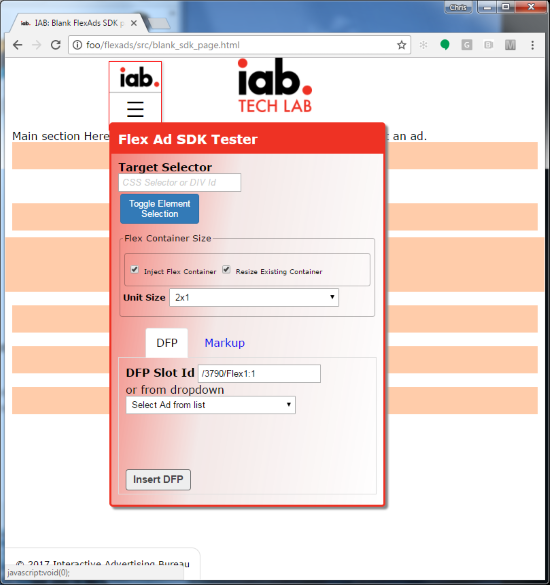

# IAB Flex Ad Testing

This project supplies samples and test helpers for the coming Flexible Ad formats.
It is broadly broken into two areas: code you might use as a publisher on your site **(src)** 
and sample code that shows some of the IAB test ads hosting within a flex container on
sample pages **(samples)**


## Project Structure ##

The below table highlights the main files of interest. There may be more files in a given directory that
are for testing or explanation.


| Directory or File          		| Description                                                                                 |
| --------------------------------- | ------------------------------------------------------------------------------------------- |
| **src**                     		| Top directory holding SDK and styles                                                        |
| pub-flex-styles.css         		| CSS classes to define a flex container with current aspect ratios (2017).                   |
| slot_definition_techniques.html 	| Description of a variety of techniques to define flex unit containers on the publisher page |
| **src/js**                		| Fles Ad Testing Javascript code |
| iab-flex-ad-tester.js    			| Flex Ad Testing SDK file. Include this on your publisher pages to test or inject flex ad units |
| **src/images**              		| Minimal images that can be used for defining flex containers. This technique has been eclipsed by the _padding-top_ technique for defining flex containers |
| **samples**                 		| Top directory holding sample publisher pages and embedded ads for testing                   |
| three_column.html   				| Sample three column layout with sample flex ads inserted |
| twin_sidebars.html   				| Sample layout with twin sidebars and sample flex ads inserted |
| **samples/dfp**   				| Sample ads served from Google DFP (Doubleclick for publishers) |


## Defining Flex Containers with CSS and Markup ##

The IAB has developed and provided CSS styles and a recommended markup structure for flex ad containers.
The provided structure and technique maximizes performance and compatibility by relying on CSS and simple markup
instead of Javascript and manually measuring aspect ratios. You can read more about this in the file
[slot_definition_techniques](./src/slot_definition_techniques.html).
This code is offered under the MIT open source license.

Include the file **_pub-flex-styles.css_** or incorporate the style classes into your site's main CSS file.

Define the following markup (example is a 4x1 container). This establishes the container. 
Markup to anchor the ad being served from an ad server should be added at **AD INSERTED HERE** 
in the below sample

```
<link rel="stylesheet" href="//your-cdn.com/src/pub-flex-styles.css">
...
<div class="iab-flexad">
	<div class="iab-flexsizer flex-4x1" ></div>
	<div class="iab-adcontent">
		<!-- AD INSERTED HERE -->
	</div>
</div>
```


## Using the Flex Ad Testing SDK ##

The IAB Flex Ad Testing SDK allows publishers to easily insert flex ad units into their existing page
structure for the purposes of testing. This Javascript include does the (not so) heavy lifting of inserting
the needed flex container styles and markup and allowing the user to insert flex containers and ads into
their existing sit markup with minimal changes.

**Example: Including the Flex Ad Testing SDK**

```
<script src="http://flexads.iabtechlab.net:8080/src/js/iab-flex-ad-tester.js"></script>
<script>
	(function(){
		iab.flexAds.setup();
	})()
</script>
```

The above code will add the IAB Flex Ad Testing SDK menu to an existing page. This is a floating menu that helps by injecting
flex containers and ads into an existing page.




### To insert a DFP ad into a location ###

1. Enter a css selector to the _Target Selector_ box or click the _Toggle Element Selection_ button and click an element to target.
2. Select a value from the _Unit Size_ dropdown. This is the Flex container size that will be inserted at the desired element.
3. Enter your DFP Ad Id into the _DFP Slit Id_ text box.
4. Click _Insert DFP_ button.


### To insert Raw ad or Ad from another Ad Network ###

1. Enter a css selector to the _Target Selector_ box or click the _Toggle Element Selection_ button and click an element to target.
2. Select a value from the _Unit Size_ dropdown. This is the Flex container size that will be inserted at the desired element.
3. Select the **Markup** tab to display the two boxes for HTML Content and Script
4. Enter any markup into the _HTML Content_ text box.
5. Enter any script or script includes into the _Script_ text box.
6. Click _Insert Content_ button.


